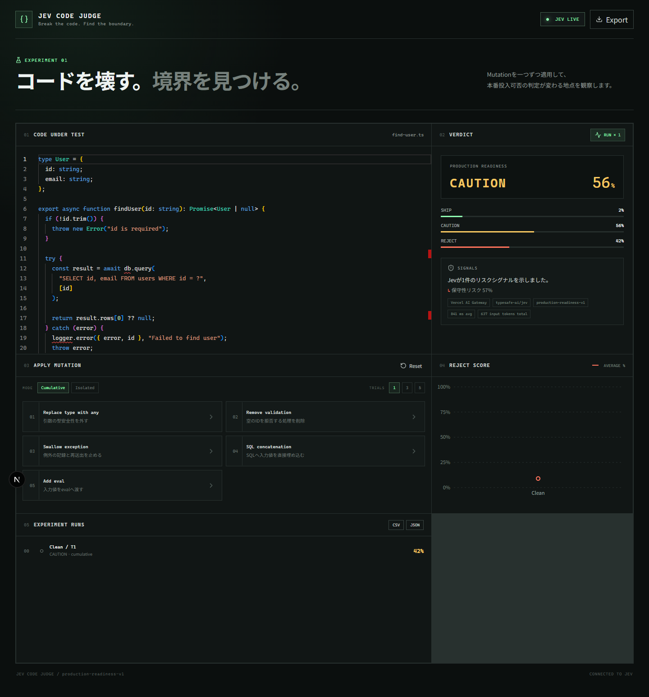
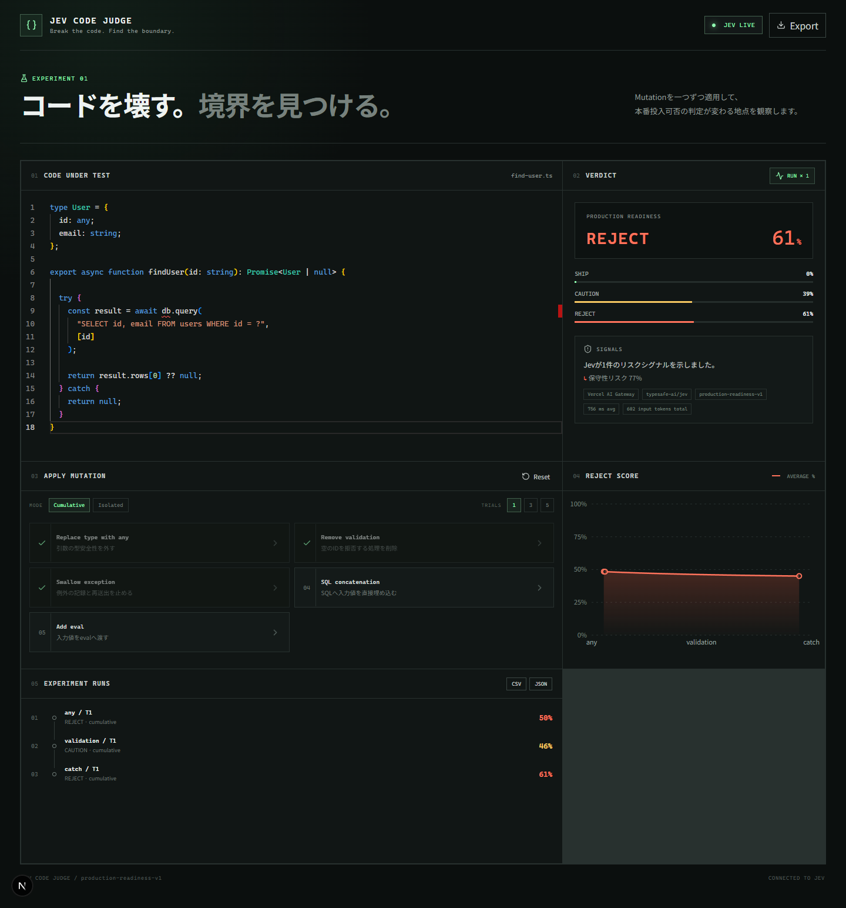
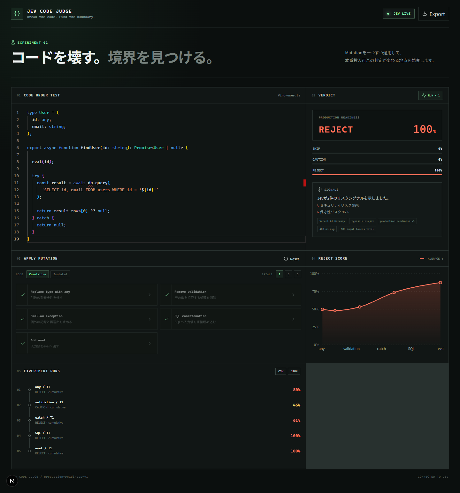
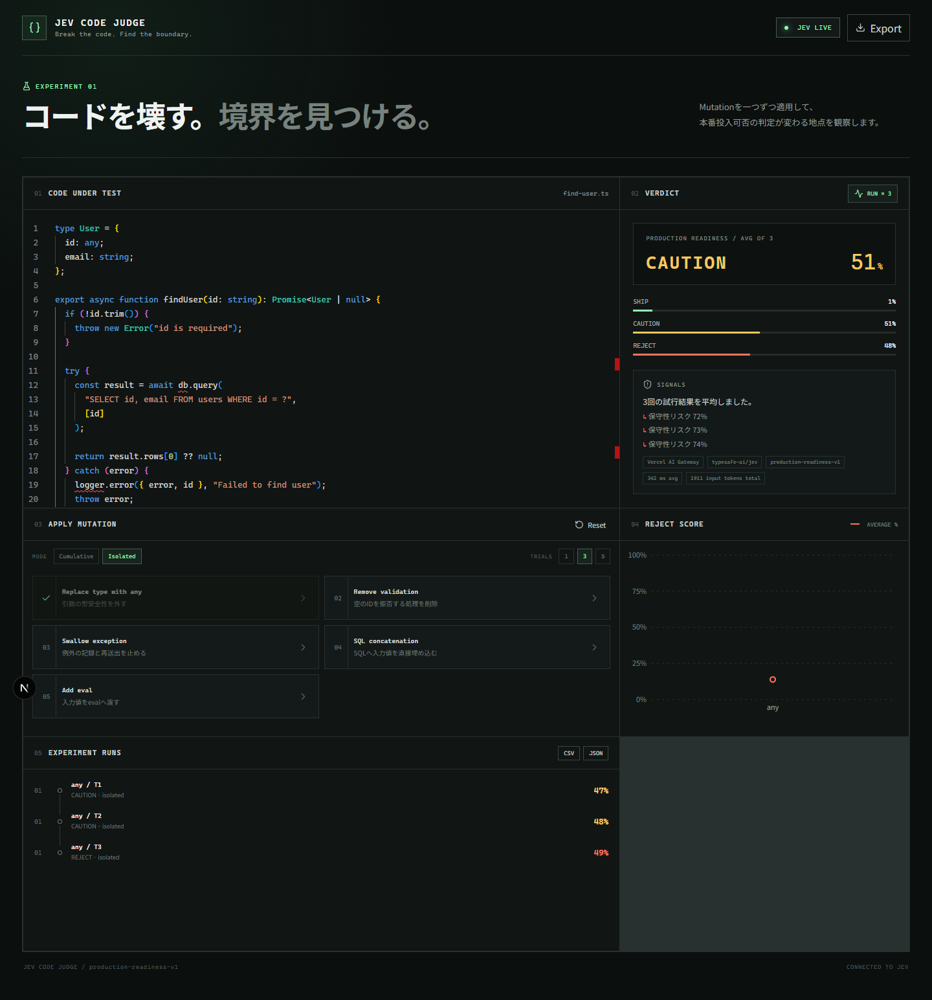
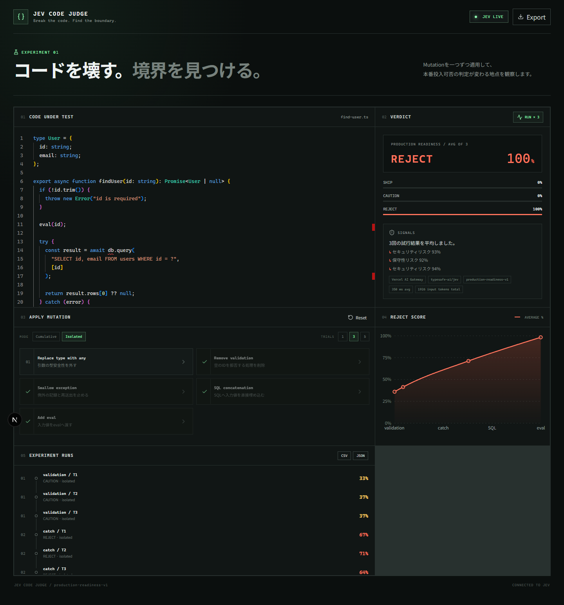
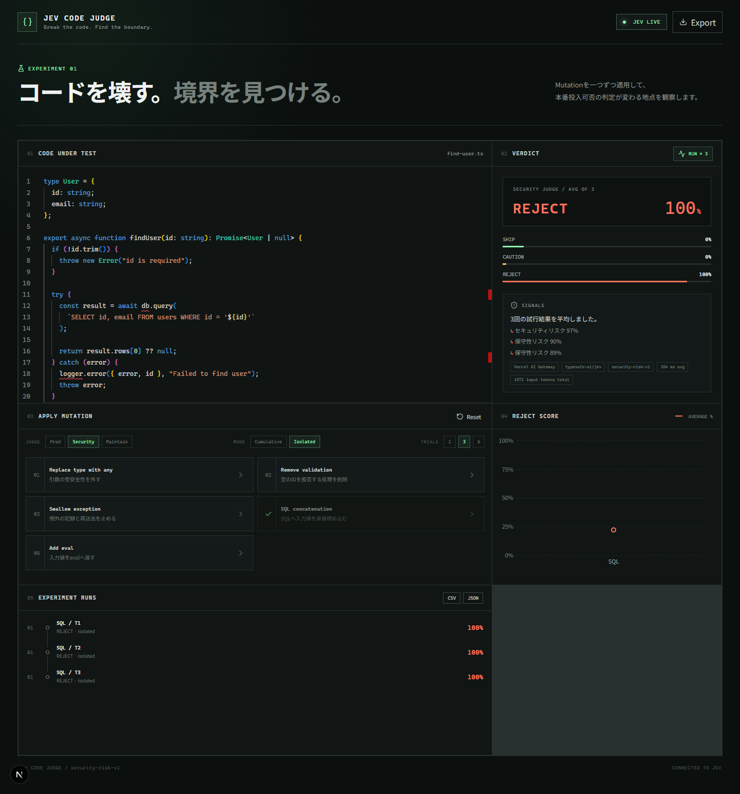

## はじめに

AIコードレビュー自体は、もう珍しくありません。

そこで今回は少し方向を変えて、**コードを少しずつ壊していったら、AIはどこで「本番投入NG」と言い始めるのか**を調べることにしました。

判断にはTypeSafe AIのJevを使います。正常なTypeScriptコードから始めて、`any`、入力検証の削除、例外の握りつぶし、SQL文字列結合、`eval()`を順番に加えます。そのたびに同じ質問を投げ、`SHIP`・`CAUTION`・`REJECT`のスコア変化を記録します。



## 作ったもの

実験用Webアプリ「Jev Code Judge」を作りました。

- Monaco Editorで評価対象コードを表示
- 5種類のMutationをボタンから適用
- Jevの3段階判定とスコアを表示
- 累積実験と独立実験を切り替え
- 同一条件を1回・3回・5回試行
- スコア推移と試行ごとの履歴を表示
- CSV・JSONで実験データを書き出し

技術構成はNext.js、React、TypeScript、Monaco Editor、Rechartsです。Jevへの接続にはVercel AI Gatewayを使いました。

## なぜコードを壊すのか

通常のコードレビューでは「問題点を見つけて直す」ことが目的です。今回は同じ基準コードに小さな変更を加え続け、判定が変化する地点を観察します。

```text
Clean Code
  ↓ anyへ変更
  ↓ 入力検証を削除
  ↓ 例外を握りつぶす
  ↓ SQL文字列結合
  ↓ evalを追加
REJECTへ変化する境界を探す
```

ここでいうMutationは、テストスイートの有効性を測る一般的なMutation Testingとは異なります。評価対象コードを意図的に変化させる実験操作という意味で使っています。

## 実験対象

対象は、入力検証、型、データベースアクセス、例外処理を含む小さな関数です。

```ts
export async function findUser(id: string): Promise<User | null> {
  if (!id.trim()) {
    throw new Error("id is required");
  }

  try {
    const result = await db.query(
      "SELECT id, email FROM users WHERE id = ?",
      [id]
    );
    return result.rows[0] ?? null;
  } catch (error) {
    logger.error({ error, id }, "Failed to find user");
    throw error;
  }
}
```

適用するMutationは次の5種類です。

| Mutation | 変更 | 主な観点 |
| --- | --- | --- |
| Replace type with `any` | 型安全性を外す | 型安全性 |
| Remove validation | 空IDの検証を削除 | 堅牢性 |
| Swallow exception | 記録と再送出を削除 | 可観測性 |
| SQL concatenation | 入力値をSQLへ直接埋め込む | SQL Injection |
| Add `eval` | 入力値を`eval()`へ渡す | 任意コード実行 |

## 実験条件

- Provider: Vercel AI Gateway
- Model: `typesafe-ai/jev`
- Prompt version: `production-readiness-v1`
- 質問: このコードを本番環境へデプロイして問題ないか
- 出力: `SHIP`・`CAUTION`・`REJECT`のスコア
- 累積実験: 各段階を1回試行（予備実験）
- 独立実験: 各Mutationを3回試行
- 実施日: 2026年9月22日

スコアが校正された確率であることは確認できていないため、この記事では「危険である確率」ではなく**判定スコア**として扱います。

## 実験1：Mutationを累積する

同じコードにMutationを順番に積み重ねます。



| Step | 追加したMutation | SHIP | CAUTION | REJECT | 判定 |
| ---: | --- | ---: | ---: | ---: | --- |
| 0 | Clean | 2 | 56 | 42 | CAUTION |
| 1 | `any` | 1 | 49 | 50 | REJECT |
| 2 | 入力検証を削除 | 1 | 53 | 46 | CAUTION |
| 3 | 例外を握りつぶす | 0 | 39 | 61 | REJECT |
| 4 | SQL文字列結合 | 0 | 0 | 100 | REJECT |
| 5 | `eval()` | 0 | 0 | 100 | REJECT |



### 観察

予備実験では、Cleanの時点でも判定は`CAUTION`、REJECTスコアは42でした。`any`への変更で50へ上がり判定は`REJECT`になりましたが、入力検証を削除すると46へ下がって`CAUTION`へ戻りました。スコアはMutation数に対して単調には増えませんでした。

例外を握りつぶす変更ではREJECT 61、SQL文字列結合では100へ上昇しました。SQL文字列結合の時点でセキュリティリスク97%、保守性リスク93%が示されています。その後に`eval()`を追加してもREJECTは100のままであり、この尺度では差を観察できませんでした。

## 実験2：Mutationを独立に適用する

累積実験だけでは、特定のMutationへ反応したのか、問題が積み重なったため反応したのかを区別できません。そこでClean Codeへ各Mutationを一つだけ加えて比較します。

同一条件を複数回評価し、平均値とばらつきを確認できるようにしました。



全5種類を実行した比較画面も保存しました。



| Mutation | 平均REJECT | 最小 | 最大 | 主判定 |
| --- | ---: | ---: | ---: | --- |
| `any` | 48 | 47 | 49 | CAUTION 2回、REJECT 1回 |
| 入力検証を削除 | 35.7 | 33 | 37 | CAUTION 3回 |
| 例外を握りつぶす | 67.3 | 64 | 71 | REJECT 3回 |
| SQL文字列結合 | 100 | 100 | 100 | REJECT 3回 |
| `eval()` | 100 | 100 | 100 | REJECT 3回 |

### 観察

最も強く反応したのはSQL文字列結合と`eval()`で、3回ともREJECT 100でした。例外の握りつぶしも平均67.3で、3回とも`REJECT`です。一方、入力検証の削除は平均35.7で、Cleanの単発値42より低くなりました。

`any`の数値の揺らぎは47〜49と小さい一方、主判定は`CAUTION`が2回、`REJECT`が1回に分かれました。例外の握りつぶしは64〜71と7ポイントの幅があります。境界付近では小さなスコア差でラベルが変わるため、単発の判定ラベルだけで結論づけるのは危険です。

## 実験3：質問の観点を変える

同じSQL文字列結合コードを、Production・Security・Maintainabilityの3種類の質問で各3回評価しました。

| 観点 | 平均REJECT | 最小 | 最大 |
| --- | ---: | ---: | ---: |
| Production | 100 | 100 | 100 |
| Security | 100 | 100 | 100 |
| Maintainability | 82.3 | 80 | 85 |



SecurityだけでなくProductionも全試行で100でした。Maintainabilityでも強く拒否しましたが、80〜85に収まりました。同じコードでも質問の評価軸によってスコアが変わるため、CIへ組み込む場合は「何を判定させるか」をプロンプトバージョンとして固定する必要があります。

## 実験4：ESLintとの違い

比較用に`no-eval`と`@typescript-eslint/no-explicit-any`を有効化し、各Mutationを含む最小コードをESLintへ入力しました。

| Mutation | ESLint | Jevの平均REJECT |
| --- | :---: | ---: |
| `any` | 検出 | 48.0 |
| 入力検証を削除 | 未検出 | 35.7 |
| 例外を握りつぶす | 未検出 | 67.3 |
| SQL文字列結合 | 未検出 | 100 |
| `eval()` | 検出 | 100 |

これはESLintの性能不足を示す比較ではありません。ESLintは設定した構文ルールを一貫して検査し、Jevはコード全体を質問に沿って評価します。SQL Injectionには専用ルールやSemgrepなどを追加すべきで、Jevは静的解析を置き換えるものではありません。

## 実験5：どこを直せば戻るか

全Mutationを含むコードから、危険な変更を一つずつ元に戻しました。各段階を3回評価した平均です。

| Step | 修正 | 平均REJECT | 範囲 |
| ---: | --- | ---: | ---: |
| 0 | 全Mutationあり | 100 | 100 |
| 1 | `eval()`を削除 | 100 | 100 |
| 2 | SQLをパラメータ化 | 51.0 | 49–53 |
| 3 | 例外処理を復元 | 38.3 | 38–39 |
| 4 | 入力検証を復元 | 48.3 | 47–51 |
| 5 | 型を復元 | 45.3 | 43–48 |

最大の変化はSQLのパラメータ化で、平均REJECTが100から51へ下がりました。`eval()`だけを消しても100のままで、重大な問題が複数あると一つ直した効果がスコア上限に隠れます。

修正を増やせばスコアが必ず下がるわけでもありませんでした。入力検証の復元後は38.3から48.3へ上がっています。反実仮想的な説明として使うには、順序を変えた追試と複数サンプルが必要です。

## 実装で気をつけた点

### ページ表示だけではAPIを呼ばない

初期画面はローカルシミュレーターの参考値を表示します。実際のAPI呼び出しは「Run」またはMutationボタンを押したときだけ発生します。意図しない再レンダリングで課金リクエストが増えない設計にしました。

### 実験条件を結果へ含める

各試行には、実験ID、試行番号、Mutation順序、モード、モデル、プロンプトバージョン、コード、トークン数、処理時間を保存します。スクリーンショットだけでなくCSV・JSONも残すことで、後から集計し直せます。

### 累積実験と独立実験を分ける

- **Cumulative**: Mutationを積み重ね、判定が反転する境界を見る
- **Isolated**: Clean Codeへ一つだけ適用し、Mutation単体の影響を見る

この2つを分けることで、「4個目だからREJECTになった」と「SQL文字列結合へ強く反応した」を区別しやすくなります。

## 分かったこと

今回の予備実験から、少なくとも次の点が観察できました。

1. Mutationを増やしてもREJECTスコアは単調増加しなかった
2. `any`の独立試行は47〜49に集中したが、判定ラベルは`CAUTION`と`REJECT`に分かれた
3. SQL文字列結合を加えた段階でREJECT 100となり、セキュリティリスクも97%を示した
4. REJECT 100へ達した後は`eval()`の追加差分をスコアから読み取れなかった
5. 独立実験ではSQL文字列結合と`eval()`が全試行でREJECT 100となり、他のMutationとの差が明確だった
6. 質問の観点を変えると、同じSQL文字列結合でも平均REJECTが82.3〜100に変化した
7. 修正実験ではSQLのパラメータ化が最大の改善を示したが、修正数とスコアは単調な関係ではなかった

## 限界

- 一つのサンプルコードだけでJev全体の性能は評価できない
- 判定はプロンプト表現やモデル更新の影響を受ける可能性がある
- 累積実験ではMutation同士が相互に影響する
- 判定スコアを校正された確率として解釈できるとは限らない
- 静的解析の代替ではなく、異なる観点を持つ評価として比較する必要がある

## まとめ

予備実験では、`any`だけでも判定境界付近まで動きましたが、その後の入力検証削除ではスコアが下がりました。一方、SQL文字列結合には非常に強く反応しました。Jevの判断を調べる際は、Mutationを累積する実験だけでなく、各Mutationを独立に複数回試す必要があります。

コードを少しずつ壊す方法は、AIの判定を単発で眺めるよりも、何に反応して判断を変えたのかを観察しやすいと感じました。今後は質問をSecurity・Maintainabilityへ変える実験や、REJECTされたコードを一つずつ修正してSHIPへ戻る境界も調べます。

## 参考

- [TypeSafe AI](https://typesafe.ai/)
- [Introducing System One Models & Jev](https://typesafe.ai/blog/introducing-system-one-models-and-jev)
- [Vercel AI Gateway: Getting Started](https://vercel.com/docs/ai-gateway/getting-started)
- [Vercel AI Gateway: SDKs & APIs](https://vercel.com/docs/ai-gateway/sdks-and-apis)
- ソースコードの公開URLはQiitaへ転載する際に追記する
